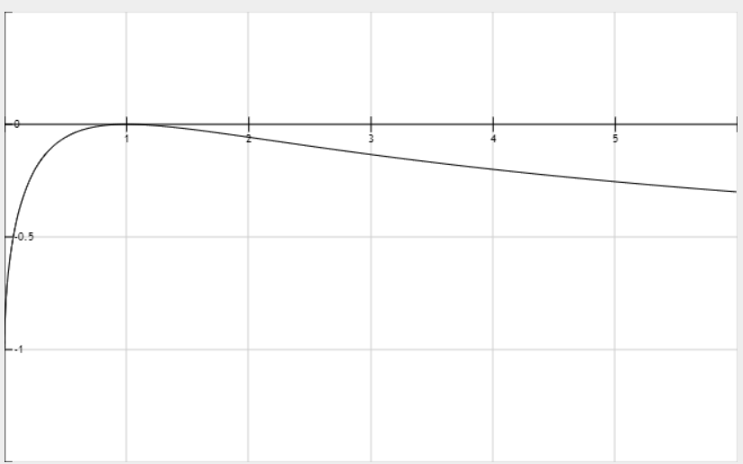

1. 行内公式，比如 $E = mc^2$

2. 块级公式: 
            $$
            a^2 + b^2 = c^2
            $$

3. 常见的 LaTeX 语法
    乘积：$ x \times y = k $
    分数：$ \frac{a}{b} $
    开平方：$ \sqrt{x} $
    求和：$ \sum_{i=1}^{n} i^2 $
    积分：$ \int_0^1 x^2 dx $
    方程组：
            \[
            \begin{cases}
            x*y = k \\
            y = p*x
            \end{cases}
            \]
    小空格：\,  \:  \;
    中空格：\quad
    大空格：\qquad

4. 绘制表格：
| 左对齐 | 居中对齐 | 右对齐 |
| :--- | :---: | ---: |
| 单元格1 | 单元格2 | 单元格3 |
| 单元格4 | 单元格5 | 单元格6 |

| 符号          |   含义            |
| :---:         | :---:             |
| x             | InputReserve      |
| $ \Delta x $  | InputAmount       |
| y             | OutputReserve     |
| $ \Delta y $  | OutputAmount      |

1. UniSwap V2 中添加流动性、移除流动性：
只需要按照 pool 中两种代币 x，y 的储量的比例进行计算即可。
$$
    \frac{x}{y} = \frac{\Delta x}{\Delta y}
$$

 

2. UniSwap V2 中进行 swap 交换：
基本原理： $ x \times y = k $

下面公式，假设投入的为 $\Delta x$，取出的为 $\Delta y$。

$$
    (x + \Delta x)(y - \Delta y) = x \times y
$$

如果不考虑手续费：
$$
    \Delta y = y \times \frac{ \Delta x }{ x + \Delta x} \qquad  input ==> output
$$
$$
    \Delta x = x \times \frac{ \Delta y }{ y - \Delta y} \qquad  input <== output
$$

如果考虑手续费：
交易手续费时，用户实际用于交换的代币量会减少，即 $ \Delta x' = (1-f) \cdot \Delta x $
其中：
$ \Delta x' $ 是 UniSwap 扣除手续费后的实际输入量
$ f $ 为手续费费率，在 UniSwap V2 中 $ f = 0.3\% $

$$
    \Delta y = y \times \frac{ \Delta x' }{ x + \Delta x'} \qquad \Delta y = y \times \frac{ \Delta x \cdot (1-f) }{ x + \Delta x \cdot (1-f)}  \qquad input ==> output
$$
$$
    \Delta x' = x \times \frac{ \Delta y }{ y - \Delta y} \qquad \Delta x = \frac{x}{1-f} \times \frac{ \Delta y }{ y - \Delta y} \qquad  input <== output
$$

 

3. UniSwap V2中的无常损失：
联立方程组，其中：p为一次函数的斜率，也就是x代币的价格，使用y表示。即1个x代币的价位为p，单位是y代币
\[
\begin{aligned}
&\begin{cases}
x \cdot y = k \\
y = p \cdot x
\end{cases} &
\Rightarrow \quad & 
\begin{cases}
x = \sqrt{\frac{k}{p}} \\
y = \sqrt{k \cdot p}
\end{cases}
\end{aligned}
\]

假设最开始的时候，具有的 $x$ 和 $y$ 的数量是 $ (x_0, \, y_0) $。那么此时具有的总价值为 $ V_0 = y_0 + p_0 \cdot x_0 $
1. 经过一段时间后，具有的 $x$ 和 $y$ 的数量是 $ (x_1, \, y_1) $。那么此时具有的总价值为 $ V_1 = y_1 + p_1 \cdot x_1 = 2 \cdot \sqrt{k \cdot p_1} $
2. 如果当时没有提供流动性，那么此时具有的总价值为 $ V_{hold} = y_0 + p_1 \cdot x_0 = \sqrt{k \cdot p_0} + p_1 \cdot \sqrt{ \frac{k}{p_0} }$

无常流动性：
$$
l = \frac{ V_1 - V_{hold} }{ V_{hold} } = \frac{V_1}{V_{hold}} - 1
$$

推导过程如下：
假设 $ p_1 = d \cdot p_0 $，即 $ d = \frac{p_1}{p_0} $，表示新价格与原价格的比值
\[
\begin{align*}
l &= \frac{ y_1 + p_1 \cdot x_1 }{ y_1 + p_1 \cdot x_0 } - 1 \\
&= \frac{ 2 \cdot \sqrt{k \cdot p_1} }{ \sqrt{k \cdot p_0} + p_1 \cdot \sqrt{ \frac{k}{p_0}} } - 1 \\
&= \frac{ 2\sqrt{d} }{ d + 1 } - 1 \\
\end{align*}
\]

其函数图像如下所示：x ∈ [0, 6]，
当 $x = 1$ 的时候，$f(x) = 0$，表示无常损失为0；
当 $x < 1$ 的时候，表示代币 $x$ 价格下降了，$ f(x) ≠ 0 $，表示无常损失不为0；
当 $x > 1$ 的时候，表示代币 $x$ 价格上涨了，$ f(x) ≠ 0 $，表示无常损失不为0；
